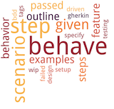

Welcome to behave!
==================

behave is behaviour-driven development, Python style.

|behave_logo|

Behavior-driven development (or BDD) is an agile software development
technique that encourages collaboration between developers, QA and
non-technical or business participants in a software project. We have
a page further describing this :doc:`philosophy <philosophy>`.

:pypi:`behave` uses tests written in a natural language style,
backed up by Python code.

Once you've :doc:`installed <install>` *behave*, we recommend reading the

* :doc:`tutorial <tutorial>` first and then
* :doc:`feature test setup <gherkin>`,
* :doc:`behave API <api>` and
* :doc:`related software <related>` (things that you can combine with :pypi:`behave`)
* finally: :doc:`how to use and configure <behave>` the :pypi:`behave` tool.

There is also a :doc:`comparison <comparison>` with the other tools available.

Contents
--------

.. toctree::
   :maxdepth: 2

   install
   tutorial
   philosophy
   gherkin
   tag_expressions
   behave
   api
   fixtures
   usecase_django
   usecase_flask
   practical_tips
   comparison
   new_and_noteworthy
   more_info
   contributing
   appendix

.. seealso::

    * `behave.example`_: `Behave Examples and Tutorials`_ (HTML)
    * Peter Parente: `BDD and Behave <https://tott-meetup.readthedocs.io/en/latest/sessions/behave.html>`_ (tutorial)

.. _behave.example: https://github.com/behave/behave.example
.. _`Behave Examples and Tutorials`: http://behave.github.io/behave.example/

Indices and tables
==================

* :ref:`genindex`
* :ref:`modindex`
* :ref:`search`

.. include:: _common_extlinks.rst
