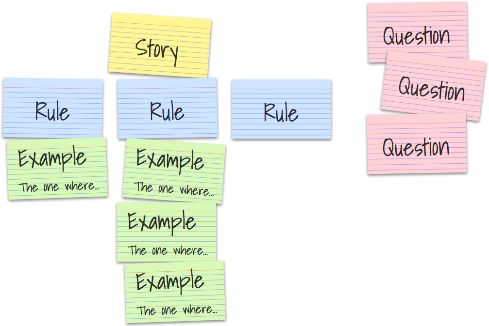

Noteworthy in Version 1.2.7
==============================================================================

Summary:

* Support `Gherkin v6 grammar`_ (to simplify usage of `Example Mapping`_)
* Use/Support :pypi:`cucumber-tag-expressions` (superceed: old-style tag-expressions)
* :pypi:`cucumber-tag-expressions` are extended by "tag-matching"
  to match partial tag names, like: ``@foo.*``
* `Select-by-location for Scenario Containers`_ (Feature, Rule, ScenarioOutline)
* `Support for emojis in feature files and steps`_
* `Improve Active-Tags Logic`_
* `Active-Tags: Use ValueObject for better Comparisons`_

.. _`Example Mapping`: https://cucumber.io/blog/example-mapping-introduction/
.. _`Example Mapping Webinar`: https://cucumber.io/blog/example-mapping-webinar/
.. _`Gherkin v6 grammar`: https://github.com/cucumber/cucumber/blob/master/gherkin/gherkin.berp

Support Gherkin v6 Grammar
-------------------------------------------------------------------------------

Grammar changes:

* ``Rule`` concept added to better correspond to `Example Mapping`_ concepts
* Add aliases for ``Scenario`` and ``Scenario Outline`` (for similar reasons)

A Rule (or: business rule) allows to group multiple Scenario(s)/Example(s)::

    # -- RULE GRAMMAR PSEUDO-CODE:
    @tag1 @tag2
    Rule: Optional Rule Title...
        Description?        #< CARDINALITY: 0..1 (optional)
        Background?         #< CARDINALITY: 0..1 (optional)
        Scenario*           #< CARDINALITY: 0..N (many)
        ScenarioOutline*    #< CARDINALITY: 0..N (many)

Gherkin v6 keyword aliases::

    | Concept          | Preferred Keyword | Alias(es)          |
    | Scenario         | Example           | Scenario           |
    | Scenario Outline | Scenario Outline  | Scenario Template  |

Example:

.. code-block:: gherkin

    # -- FILE: features/example_with_rules.feature
    # USING: Gherkin v6
    Feature: With Rules

      Background: Feature.Background
        Given feature background step_1

      Rule: Rule_1
        Background: Rule_1.Background
          Given rule_1 background step_1

        Example: Rule_1.Example_1
          Given rule_1 scenario_1 step_1

      Rule: Rule_2

        Example: Rule_2.Example_1
          Given rule_2 scenario_1 step_1

      Rule: Rule_3
        Background: Rule_3.EmptyBackground
        Example: Rule_3.Example_1
          Given rule_3 scenario_1 step_1

Overview of the `Example Mapping`_ concepts:

.. seealso::

    **Gherkin v6**:

    * https://docs.cucumber.io/gherkin/reference/
    * `Gherkin v6 grammar`_

    **Example Mapping:**

    * Cucumber: Introduction to `Example Mapping`_ (by: Matt Wynne)
    * Cucumber: `Example Mapping Webinar`_
    * https://docs.cucumber.io/bdd/example-mapping/

    **More on Example Mapping:**

    * https://speakerdeck.com/mattwynne/rules-vs-examples-bddx-london-2014
    * https://lisacrispin.com/2016/06/02/experiment-example-mapping/
    * https://tobythetesterblog.wordpress.com/2016/05/25/how-to-do-example-mapping/

.. hint:: **Gherkin v6 Grammar Issues**

    * :cucumber.issue:`632`: Rule tags are currently only supported in `behave`.
      The Cucumber Gherkin v6 grammar currently lacks this functionality.

    * :cucumber.issue:`590`: Rule Background:
      A proposal is pending to remove Rule Backgrounds again

.. include:: _content.tag_expressions_v2.rst

Select-by-location for Scenario Containers
-------------------------------------------------------------------------------

In the past, it was already possible to scenario(s) by using its **file-location**.

A **file-location** has the schema: ``<FILENAME>:<LINE_NUMBER>``.
Example: ``features/alice.feature:12``
(refers to ``line 12`` in ``features/alice.feature`` file).

Rules to select **Scenarios** by using the file-location:

* **Scenario:** Use a file-location that points to the keyword/title or its steps
  (until next Scenario/Entity starts).

* **Scenario of a ScenarioOutline:**
  Use the file-location of its Examples row.

Now you can select all entities of a **Scenario Container** (Feature, Rule, ScenarioOutline):

* **Feature:**
  Use file-location before first contained entity/Scenario starts.

* **Rule:**
  Use file-location from keyword/title line to line before its first Scenario/Background.

* **ScenarioOutline:**
  Use file-location from keyword/title line to line before its Examples rows.

A file-location into a **Scenario Container** selects all its entities
(Scenarios, ...).

Support for Emojis in Feature Files and Steps
-------------------------------------------------------------------------------

* Emojis can now be used in ``*.feature`` files.
* Emojis can now be used in step definitions.
* You can now use ``language=emoji (em)`` in ``*.feature`` files ;-)

.. literalinclude:: ../features/i18n_emoji.feature
    :prepend:  # -- FILE: features/i18n_emoji.feature
    :language: gherkin

.. literalinclude:: ../features/steps/i18n_emoji_steps.py
    :prepend:  # -- FILE: features/steps/i18n_emoji_steps.py
    :language: python

Improve Active-Tags Logic
-------------------------------------------------------------------------------

The active-tag computation logic was slightly changed (and fixed):

* if multiple active-tags with same category are used
* combination of positive active-tags (``use.with_{category}={value}``) and
  negative active-tags (``not.with_{category}={value}``) with same category
  are now supported

All active-tags with same category are combined into one category tag-group.
The following logical expression is used for active-tags with the same category::

    category_tag_group.enabled := positive-tag-expression and not negative-tag-expression
      positive-tag-expression  := enabled(tag1) or enabled(tag2) or ...
      negative-tag-expression  := enabled(tag3) or enabled(tag4) or ...
       tag1, tag2 are positive-tags, like @use.with_category=value
       tag3, tag4 are negative-tags, like @not.with_category=value

EXAMPLE:

.. code-block:: gherkin

    Feature: Active-Tag Example

      @use.with_browser=Safari
      @use.with_browser=Chrome
      @not.with_browser=Firefox
      Scenario: Use one active-tag group/category

        HINT: Only executed with web browser Safari and Chrome, Firefox is explicitly excluded.
        ...

      @use.with_browser=Firefox
      @use.with_os=linux
      @use.with_os=darwin
      Scenario: Use two active-tag groups/categories

        HINT 1: Only executed with browser: Firefox
        HINT 2: Only executed on OS: Linux and Darwin (macOS)
        ...

Active-Tags: Use ValueObject for better Comparisons
-------------------------------------------------------------------------------

The current mechanism of active-tags only supports the ``equals / equal-to`` comparison
mechanism to determine if the ``tag.value`` matches the ``current.value``, like::

    # -- SCHEMA: "@use.with_{category}={value}" or "@not.with_{category}={value}"
    @use.with_browser=Safari    # HINT: tag.value = "Safari"

    ACTIVE TAG MATCHES, if: current.value == tag.value  (for string values)

The ``equals`` comparison method is sufficient for many situations.
But in some situations, you want to use other comparison methods.
The ``behave.tag_matcher.ValueObject`` class was added to allow
the user to provide an own comparison method (and type conversion support).

**EXAMPLE 1:**

.. code:: gherkin

    Feature: Active-Tag Example 1 with ValueObject

      @use.with_temperature.min_value=15
      Scenario: Only run if temperature >= 15 degrees Celcius
        ...

.. code:: python

    # -- FILE: features/environment.py
    import operator
    from behave.tag_matcher import ActiveTagMatcher, ValueObject
    from my_system.sensors import Sensors

    # -- SIMPLIFIED: Better use behave.tag_matcher.NumberValueObject
    # CTOR: ValueObject(value, compare=operator.eq)
    # HINT: Parameter "value" can be a getter-function (w/o args).
    class NumberValueObject(ValueObject):
        def matches(self, tag_value):
            tag_number = int(tag_value)
            return self.compare(self.value, tag_number)

    current_temperature = Sensors().get_temperature()
    active_tag_value_provider = {
        # -- COMPARISON:
        # temperature.value:     current.value == tag.value  -- DEFAULT: equals  (eq)
        # temperature.min_value: current.value >= tag.value  -- greater_or_equal (ge)
        "temperature.value":     NumberValueObject(current_temperature),
        "temperature.min_value": NumberValueObject(current_temperature, operator.ge),
    }
    active_tag_matcher = ActiveTagMatcher(active_tag_value_provider)

    # -- HOOKS SETUP FOR ACTIVE-TAGS: ... (omitted here)

**EXAMPLE 2:**

A slightly more complex situation arises, if you need to constrain the
execution of an scenario to a temperature range, like:

.. code:: gherkin

    Feature: Active-Tag Example 2 with Min/Max Value Range

      @use.with_temperature.min_value=10
      @use.with_temperature.max_value=70
      Scenario: Only run if temperature is between 10 and 70 degrees Celcius
        ...

.. code:: python

    # -- FILE: features/environment.py
    ...
    current_temperature = Sensors().get_temperature()
    active_tag_value_provider = {
        # -- COMPARISON:
        # temperature.min_value:  current.value >= tag.value
        # temperature.max_value:  current.value <= tag.value
        "temperature.min_value": NumberValueObject(current_temperature, operator.ge),
        "temperature.max_value": NumberValueObject(current_temperature, operator.le),
    }
    ...

**EXAMPLE 3:**

.. code:: gherkin

    Feature: Active-Tag Example 3 with Contains/Contained-in Comparison

      @use.with_supported_payment_method=VISA
      Scenario: Only run if VISA is one of the supported payment methods
        ...

      # OR: @use.with_supported_payment_methods.contains_value=VISA

.. code:: python

    # -- FILE: features/environment.py
    # NORMALLY:
    #  from my_system.payment import get_supported_payment_methods
    #  payment_methods = get_supported_payment_methods()
    ...
    payment_methods = ["VISA", "MasterCard", "paycheck"]
    active_tag_value_provider = {
        # -- COMPARISON:
        # supported_payment_method: current.value contains tag.value
        "supported_payment_method": ValueObject(payment_methods, operator.contains),
    }
    ...
